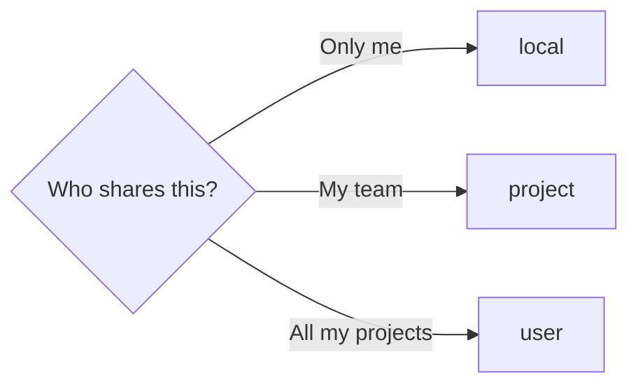

# Rules for AI


Portable rules and skills for AI coding agents.

Write your rules once and carry them across Claude Code and Cursor as an installable, updatable plugin — no more copy-pasting the same instructions into every machine and repository. Language preferences for issues, pull requests, comments, logs, and test logs are resolved per user and overridden per project. Use it as is, or fork it and swap in your own rules.

## Getting Started

[rules-for-ai.sh](./rules-for-ai.sh) installs, updates, and uninstalls everything. Choose a platform — **claude** or **cursor** — and a scope.

### Scopes

| Scope | Meaning |
|-------|---------|
| **user** | Every project on this machine |
| **project** | One repo, shared with your team via git |
| **local** | One repo, just you, nothing committed |



### Without cloning

For **project** or **local**, run inside the target repo:

```bash
curl -fsSL https://raw.githubusercontent.com/hashiiiii/rules-for-ai/main/rules-for-ai.sh | sh -s -- install claude user
curl -fsSL https://raw.githubusercontent.com/hashiiiii/rules-for-ai/main/rules-for-ai.sh | sh -s -- install cursor project
```

### From a clone

```bash
./rules-for-ai.sh install claude project path/to/repo
./rules-for-ai.sh uninstall cursor user
```

Re-running install updates in place. Uninstall removes exactly what install created.

What each platform puts where, and how locale reaches the model, is in [Platform details](#platform-details).

### Locale

Two layers decide the effective language:

1. **Project instructions** — a repo's own `CLAUDE.md` / `AGENTS.md` language policy always wins when present.
2. **Resolved keys** — otherwise the first existing file wins as a whole; layers never merge:
   - `~/.config/rules-for-ai/LOCALE.md` (respect `$XDG_CONFIG_HOME` when set)
   - the plugin's bundled [LOCALE.default.md](./LOCALE.default.md)
   - an inline `en_US` default for all keys

There is no project-level `LOCALE.md`. A file at the project root is ignored. Put project-specific language policy in that project's `CLAUDE.md` / `AGENTS.md` instead.

Every LOCALE file must carry all five keys (POSIX-style tags such as `ja_JP` or `en_US`):

| Key | Artifact |
|-----|----------|
| `issues` | Issues |
| `pull-requests` | Pull requests |
| `comments` | Code comments |
| `logs` | Log messages |
| `test-logs` | Test log messages |

Create or update the user-level file with the `hashiiiii-locale` skill (after a **user** install). Examples:

- One tag for everything: `ja_JP`
- Per artifact: `issues=ja_JP pull-requests=ja_JP comments=ja_JP logs=en_US test-logs=en_US`

The skill always writes `~/.config/rules-for-ai/LOCALE.md` with all five keys. It never writes a LOCALE file into a project.

## Platform details

- [Claude Code](./docs/CLAUDE_CODE.md) — settings paths, SessionStart injection, locale resolution
- [Cursor](./docs/CURSOR.md) — per-scope files, hooks.json, how locale reaches context

## Updates

Re-run the same install command (or the curl one-liner). Claude Code can also run `/plugin marketplace update hashiiiii`.

## Fork and customize

Fork, edit [AGENTS.md](./AGENTS.md) and [skills/](./skills/), then install from your fork instead of hashiiiii/rules-for-ai.

Skills use the `hashiiiii-` prefix. Rename to your own and find every reference:

```bash
grep -rl 'hashiiiii-' .
```

Also set `REPO` in [rules-for-ai.sh](./rules-for-ai.sh) and `repository` in [.claude-plugin/plugin.json](./.claude-plugin/plugin.json).

## Releasing (maintainers)

Releases are cut from the Actions tab — no local tagging.

1. Open **Actions → release → Run workflow**, keep `main` selected, and enter the version as `X.Y.Z` (no `v` prefix).
2. The workflow bumps `version` in both plugin manifests, commits `chore: release vX.Y.Z`, tags it, and creates the GitHub release with generated notes.

The release commit is authored by a GitHub App, so a one-time setup is required: install the App on this repo, add its `APP_CLIENT_ID` / `APP_PRIVATE_KEY` secrets, and add the App to the `main` ruleset's bypass actors so it can push the commit past the pull-request requirement.

## License

[MIT](LICENSE.md)
