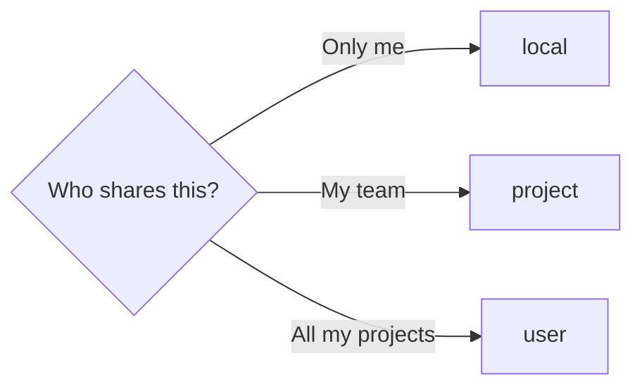

# Rules for AI


Portable rules and skills for AI coding agents.

Write your rules once and carry them across Claude Code and Cursor as an installable, updatable plugin — no more copy-pasting the same instructions into every machine and repository. Language preferences for issues, pull requests, comments, logs, and test logs are resolved per user and overridden per project. Use it as is, or fork it and swap in your own rules.

## Contents

| Path | Purpose |
|------|---------|
| [AGENTS.md](./AGENTS.md) | Shared behavioral principles |
| [LOCALE.default.md](./LOCALE.default.md) | Default language settings |
| [skills/](./skills/) | Git, GitHub issue, pull request, and locale skills |
| [hooks/](./hooks/) | Session-start hooks (Claude Code and Cursor) |
| [rules-for-ai.sh](./rules-for-ai.sh) | One-command installer for every platform × scope |
| [rules/](./rules/) | Cursor always-on rule |
| [.claude-plugin/](./.claude-plugin/), [.cursor-plugin/](./.cursor-plugin/) | Plugin and marketplace manifests |

## Setup

[rules-for-ai.sh](./rules-for-ai.sh) installs, updates, and uninstalls everything. Choose a platform — **claude** or **cursor** — and a scope:

| Scope | Meaning |
|-------|---------|
| **user** | Every project on this machine |
| **project** | One repo, shared with your team via git |
| **local** | One repo, just you, nothing committed |



**Without cloning** — for **project** or **local**, run inside the target repo:

```bash
curl -fsSL https://raw.githubusercontent.com/hashiiiii/rules-for-ai/main/rules-for-ai.sh | sh -s -- install claude user
curl -fsSL https://raw.githubusercontent.com/hashiiiii/rules-for-ai/main/rules-for-ai.sh | sh -s -- install cursor project
```

**From a clone:**

```bash
./rules-for-ai.sh install claude project path/to/repo
./rules-for-ai.sh uninstall cursor user
```

Re-running install updates in place. Uninstall removes exactly what install created.

### Claude Code

Requires the Claude Code CLI. Scopes follow `claude plugin ... --scope`:

- **user** → ~/.claude/settings.json
- **project** → the repo's `.claude/settings.json` (commit it — teammates only accept the trust prompt)
- **local** → `.claude/settings.local.json` (not tracked; no `.gitignore` change needed)

Each session, the SessionStart hook injects [AGENTS.md](./AGENTS.md) and your resolved locale keys.

**project** install also pins the marketplace and enables the plugin in `.claude/settings.json`. The same block can be added by hand:

```json
{
  "extraKnownMarketplaces": {
    "hashiiiii": {
      "source": { "source": "github", "repo": "hashiiiii/rules-for-ai" }
    }
  },
  "enabledPlugins": { "rules-for-ai@hashiiiii": true }
}
```

Installed at **user** scope but want it off in one repo? Add to that repo's `.claude/settings.json`:

```json
{ "enabledPlugins": { "rules-for-ai@hashiiiii": false } }
```

Prefer the UI? Run `/plugin marketplace add hashiiiii/rules-for-ai`, then `/plugin install rules-for-ai@hashiiiii`.

### Cursor

- **user** — clones into `~/.cursor/plugins/local/` (restart Cursor after). Teams/Enterprise can import the repo from Settings → Plugins → Import from Repo instead.
- **project** — copies [rules/agents.mdc](./rules/agents.mdc) into `.cursor/rules/`, the skills (except `hashiiiii-locale`) into `.cursor/skills/`, and the locale hook into `.cursor/rules-for-ai/`; writes `.cursor/hooks.json` unless one already exists (then it prints the entry to add manually). Commit them; teammates need no install, though Cursor may ask each developer to approve the hook.
- **local** — same as **project**, plus `.git/info/exclude` entries so nothing appears in `git status`.

> [!WARNING]
> Already enabled for Claude Code? Cursor can import it from `~/.claude/plugins/` — do not also install at **cursor** **user** scope.

### Locale

After a **user** install, run the `/hashiiiii-locale` skill to set languages for issues, pull requests, code comments, logs, and test logs.

For **project** or **local**, skip it — that skill writes user-level config. Put language policy in the target project's [CLAUDE.md](./CLAUDE.md) or Cursor rules instead; project instructions override resolved locale keys by design.

#### How locale reaches the model

Two layers decide the effective language:

1. **Project instructions** — a repo's own `CLAUDE.md` / `AGENTS.md` language policy always wins.
2. **Resolved keys** — otherwise the first existing file wins as a whole: `~/.config/rules-for-ai/LOCALE.md`, else the plugin's bundled [LOCALE.default.md](./LOCALE.default.md), else an inline `en_US` default. Layers never merge.

| Platform | Scope | Resolved keys delivered by |
|----------|-------|----------------------------|
| Claude Code | user / project / local | SessionStart hook |
| Cursor | user | the model reads the cloned plugin files |
| Cursor | project / local | `sessionStart` hook in `.cursor/hooks.json`, after each developer approves it |

Cursor project and local installs carry no bundled default, so their hook falls back to inline `en_US` when no user-level `LOCALE.md` exists.

## Updates

Re-run the same install command (or the curl one-liner). Claude Code can also run `/plugin marketplace update hashiiiii`.

## Fork and customize

Fork, edit [AGENTS.md](./AGENTS.md) and [skills/](./skills/), then install from your fork instead of hashiiiii/rules-for-ai.

Skills use the `hashiiiii-` prefix. Rename to your own and find every reference:

```bash
grep -rl 'hashiiiii-' .
```

Also set `REPO` in [rules-for-ai.sh](./rules-for-ai.sh) and `repository` in [.claude-plugin/plugin.json](./.claude-plugin/plugin.json).

## Releasing (maintainers)

Releases are cut from the Actions tab — no local tagging.

1. Open **Actions → release → Run workflow**, keep `main` selected, and enter the version as `X.Y.Z` (no `v` prefix).
2. The workflow bumps `version` in both plugin manifests, commits `chore: release vX.Y.Z`, tags it, and creates the GitHub release with generated notes.

The release commit is authored by a GitHub App, so a one-time setup is required: install the App on this repo, add its `APP_CLIENT_ID` / `APP_PRIVATE_KEY` secrets, and add the App to the `main` ruleset's bypass actors so it can push the commit past the pull-request requirement.

## License

[MIT](LICENSE.md)
