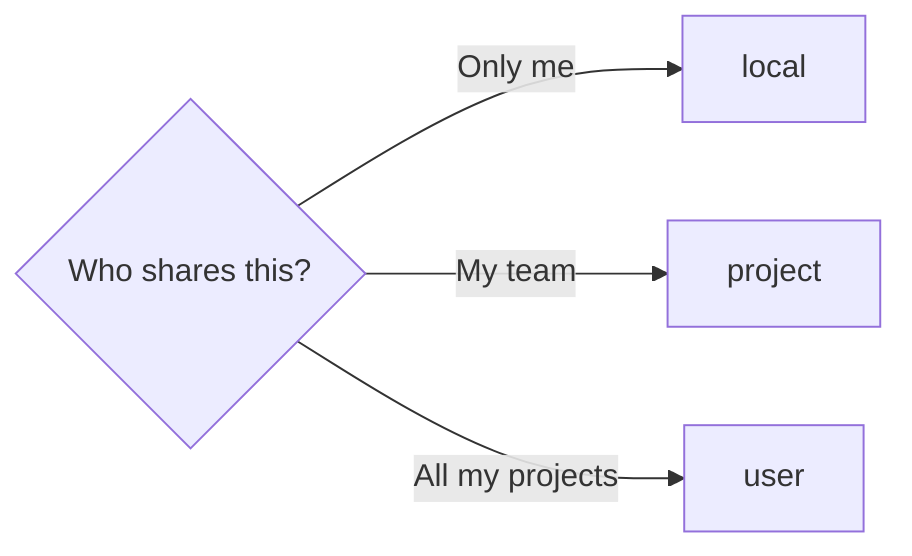

# Rules for AI

Rules for AI supplies portable rules and skills for AI coding agents.

Write the rules one time. Then use the same rules with Claude Code and Cursor through an installable plugin.

The plugin manages language preferences for issues, pull requests, comments, logs, and test logs. A project can override the preferences of a user.

Use the plugin without changes. You can also fork it and add your own rules.

## Getting Started

[rules-for-ai.sh](./rules-for-ai.sh) installs, updates, and removes the plugin. Select a platform: **claude** or **cursor**. Then select a scope.

### Scopes


| Scope       | Meaning                                 |
| ----------- | --------------------------------------- |
| **user**    | Use the plugin in every project on this machine.     |
| **project** | Share the plugin with your team through Git.         |
| **local**   | Use the plugin in one repository without committed files.  |



```mermaid
flowchart LR
  Q{Who shares this?}
  Q -->|Only me| L[local]
  Q -->|My team| P[project]
  Q -->|All my projects| U[user]
```


### Without cloning

```bash
curl -fsSL https://raw.githubusercontent.com/hashiiiii/rules-for-ai/main/rules-for-ai.sh | sh -s -- <install|uninstall> <claude|cursor> <user|project|local> [path/to/repo]
# e.g. curl -fsSL https://raw.githubusercontent.com/hashiiiii/rules-for-ai/main/rules-for-ai.sh | sh -s -- install claude user
```

### From a clone

```bash
./rules-for-ai.sh <install|uninstall> <claude|cursor> <user|project|local> [path/to/repo]
# e.g. ./rules-for-ai.sh install cursor project path/to/repo
```

Use `path/to/repo` only with **project** and **local** scopes. If you omit the path, the command uses the current directory.

Run install again to update the plugin. Uninstall removes only the files that install created.

See [Platform details](#platform-details) for the installed files and the locale process.

### Locale

The plugin installation scope and the locale scope are independent. The `hashiiiii-locale` skill supports three locale scopes:

| Scope | Path | Sharing behavior |
| --- | --- | --- |
| **user** | `~/.config/rules-for-ai/LOCALE.md` | Use the locale in all projects for this user. |
| **project** | `<repo>/.rules-for-ai/LOCALE.md` | Commit the locale for team use. |
| **local** | `<absolute-git-dir>/rules-for-ai/LOCALE.md` | Use the locale in one Git worktree, outside `git status`. |

The user path uses `$XDG_CONFIG_HOME`. The command `git rev-parse --absolute-git-dir` supplies the local path.

If you do not specify a scope, the skill asks you to select `user`, `project`, or `local`.

The skill does not infer the locale scope from the plugin installation scope.

Each locale file contains all five keys. Each key uses a POSIX-style tag, such as `ja_JP` or `en_US`:


| Key             | Artifact          |
| --------------- | ----------------- |
| `issues`        | Issues            |
| `pull-requests` | Pull requests     |
| `comments`      | Code comments     |
| `logs`          | Log messages      |
| `test-logs`     | Test log messages |


To set one tag for all artifacts, give the skill a scope and a tag:

```text
local ja_JP
```

To set each artifact separately, use this format:

```text
project issues=ja_JP pull-requests=ja_JP comments=ja_JP logs=en_US test-logs=en_US
```

The plugin resolves the effective language in this order:

1. **Project instructions**: A repository can specify a language in `CLAUDE.md` or `AGENTS.md`.
2. **Resolved keys**: If project instructions do not specify a language, the first existing locale file wins as a whole:
   1. Local locale file
   2. Project locale file
   3. User locale file
   4. Bundled [LOCALE.default.md](./LOCALE.default.md)
   5. Inline `en_US` values

The locale layers do not merge during resolution.

During a partial update, omitted keys use the selected scope, then lower-priority scopes.

Both platforms use the same resolver. A session hook adds the resolved keys to the context.

## Platform details

- [Claude Code](./docs/CLAUDE_CODE.md): file paths, SessionStart input, and locale resolution
- [Cursor](./docs/CURSOR.md): files for each scope, `hooks.json`, and locale context

## Updates

Run the same install command or curl command again. For Claude Code, you can also run `/plugin marketplace update hashiiiii`.

## Fork and customize

Fork the repository. Then edit [AGENTS.md](./AGENTS.md) and [skills/](./skills/).

Install the plugin from your fork instead of `hashiiiii/rules-for-ai`.

Skills use the `hashiiiii-` prefix. Replace this prefix with your prefix.

Find each reference with this command:

```bash
grep -rl 'hashiiiii-' .
```

Set `REPO` in [rules-for-ai.sh](./rules-for-ai.sh). Then set `repository` in [.claude-plugin/plugin.json](./.claude-plugin/plugin.json).

## Releasing (maintainers)

Create releases from the Actions tab. Do not create local tags.

1. Open **Actions → release → Run workflow**.
2. Keep `main` selected.
3. Enter the version as `X.Y.Z` without a `v` prefix.

The workflow updates `version` in both plugin manifests. Then it creates the commit, tag, and GitHub release.

The commit uses a GitHub App as its author. Complete this setup one time:

1. Install the App in this repository.
2. Add the `APP_CLIENT_ID` and `APP_PRIVATE_KEY` secrets.
3. Add the App to the bypass actors for the `main` ruleset.

This bypass lets the App push the release commit without a pull request.

## License

[MIT](LICENSE.md)
