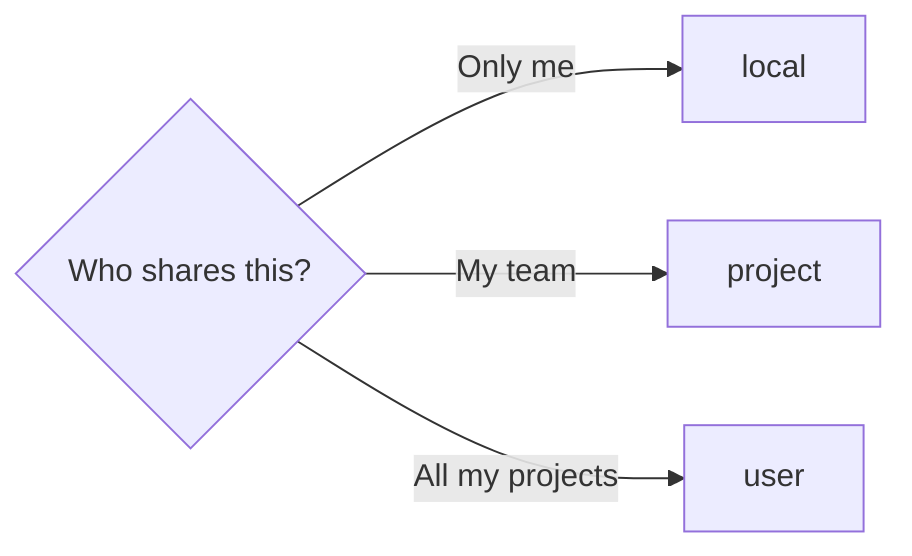

# Rules for AI

Portable rules and skills for AI coding agents.

Write your rules once and carry them across Claude Code and Cursor as an installable, updatable plugin — no more copy-pasting the same instructions into every machine and repository. Language preferences for issues, pull requests, comments, logs, and test logs are resolved per user and overridden per project. Use it as is, or fork it and swap in your own rules.

## Getting Started

[rules-for-ai.sh](./rules-for-ai.sh) installs, updates, and uninstalls everything. Choose a platform — **claude** or **cursor** — and a scope.

### Scopes


| Scope       | Meaning                                 |
| ----------- | --------------------------------------- |
| **user**    | Every project on this machine           |
| **project** | One repo, shared with your team via git |
| **local**   | One repo, just you, nothing committed   |



```mermaid
flowchart LR
  Q{Who shares this?}
  Q -->|Only me| L[local]
  Q -->|My team| P[project]
  Q -->|All my projects| U[user]
```


### Without cloning

```bash
curl -fsSL https://raw.githubusercontent.com/hashiiiii/rules-for-ai/main/rules-for-ai.sh | sh -s -- <install|uninstall> <claude|cursor> <user|project|local> [path/to/repo]
# e.g. curl -fsSL https://raw.githubusercontent.com/hashiiiii/rules-for-ai/main/rules-for-ai.sh | sh -s -- install claude user
```

### From a clone

```bash
./rules-for-ai.sh <install|uninstall> <claude|cursor> <user|project|local> [path/to/repo]
# e.g. ./rules-for-ai.sh install cursor project path/to/repo
```

`path/to/repo` applies to **project** and **local** only and defaults to the current directory. Re-running install updates in place. Uninstall removes exactly what install created.

What each platform puts where, and how locale reaches the model, is in [Platform details](#platform-details).

### Locale

The plugin installation scope and the locale scope are separate choices. The `hashiiiii-locale` skill supports all three locale scopes:

| Scope | Path | Sharing behavior |
| --- | --- | --- |
| **user** | `~/.config/rules-for-ai/LOCALE.md` | All projects for this user |
| **project** | `<repo>/.rules-for-ai/LOCALE.md` | Available for commit and team use |
| **local** | `<absolute-git-dir>/rules-for-ai/LOCALE.md` | One Git worktree, outside `git status` |

The user path respects `$XDG_CONFIG_HOME`. The local path comes from `git rev-parse --absolute-git-dir`.

If you do not specify a scope, the skill asks you to select `user`, `project`, or `local`. It never infers the locale scope from the plugin installation scope.

Each locale file contains all five keys with POSIX-style tags such as `ja_JP` or `en_US`:


| Key             | Artifact          |
| --------------- | ----------------- |
| `issues`        | Issues            |
| `pull-requests` | Pull requests     |
| `comments`      | Code comments     |
| `logs`          | Log messages      |
| `test-logs`     | Test log messages |


Give the skill a scope and one tag for all artifacts:

```text
local ja_JP
```

You can also set each artifact separately:

```text
project issues=ja_JP pull-requests=ja_JP comments=ja_JP logs=en_US test-logs=en_US
```

The effective language uses these layers:

1. **Project instructions** — a repo's own `CLAUDE.md` / `AGENTS.md` language policy always wins when present.
2. **Resolved keys** — otherwise the first existing locale file wins as a whole:
   1. Local locale file
   2. Project locale file
   3. User locale file
   4. Bundled [LOCALE.default.md](./LOCALE.default.md)
   5. Inline `en_US` values

Layers never merge during resolution. A partial update fills omitted keys from the selected scope and lower-priority scopes.

Both platforms use the same resolver. A session hook injects the resolved keys into context.

## Platform details

- [Claude Code](./docs/CLAUDE_CODE.md) — settings paths, SessionStart injection, locale resolution
- [Cursor](./docs/CURSOR.md) — per-scope files, hooks.json, how locale reaches context

## Updates

Re-run the same install command (or the curl one-liner). Claude Code can also run `/plugin marketplace update hashiiiii`.

## Fork and customize

Fork, edit [AGENTS.md](./AGENTS.md) and [skills/](./skills/), then install from your fork instead of hashiiiii/rules-for-ai.

Skills use the `hashiiiii-` prefix. Rename to your own and find every reference:

```bash
grep -rl 'hashiiiii-' .
```

Also set `REPO` in [rules-for-ai.sh](./rules-for-ai.sh) and `repository` in [.claude-plugin/plugin.json](./.claude-plugin/plugin.json).

## Releasing (maintainers)

Releases are cut from the Actions tab — no local tagging.

1. Open **Actions → release → Run workflow**, keep `main` selected, and enter the version as `X.Y.Z` (no `v` prefix).
2. The workflow bumps `version` in both plugin manifests, commits `chore: release vX.Y.Z`, tags it, and creates the GitHub release with generated notes.

The release commit is authored by a GitHub App, so a one-time setup is required: install the App on this repo, add its `APP_CLIENT_ID` / `APP_PRIVATE_KEY` secrets, and add the App to the `main` ruleset's bypass actors so it can push the commit past the pull-request requirement.

## License

[MIT](LICENSE.md)
